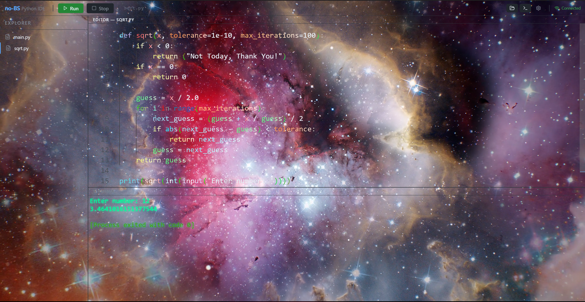

# That's a video in the background, all tokens are animating too

# 🐍🔥 ULTRA EPIC PYTHON IDE (no-bullshi-) 🔥🐍

> yes this exists
> no it shouldn’t
> yes it works (mostly)

---

## 💀 what is this

this is a **custom python IDE** made with **electron** because clearly i enjoy suffering 👍

it is:

* not perfect ❌
* kinda buggy 🐛
* held together by hopes, dreams, and questionable decisions 🧠

but ALSO:

* actually usable 😳
* kinda cool 👀
* better than most ides out there (cope if you disagree)

---

## 🚀 how to run this masterpiece

Download ZIP, then unzip it and follow these steps

step 1 (DO NOT SKIP OR EVERYTHING EXPLODES):

```
pnpm install
```

(run this in the **root directory**)

step 2 (YES AGAIN):

```
cd no-bs-ide
pnpm install
```

step 3:

```
*double click* script.bat
```

that’s it. no config. no setup. no braincells required.
it just launches. like magic. ✨

---

## 🧭 where tf are the settings

top left.
literally top left.

if you can’t find it, that’s a skill issue.

---

## 🧠 features (yes it has those)

* 🐍 built-in python interpreter (no setup pain, just vibes)
* 🎨 **per-token customization** (yeah, EVERY token. go insane.)
* 🎥 background VIDEO support (your IDE can now distract you 🔥)
* ⚡ fast-ish (depends on your life choices)
* 🧩 beginner friendly (this is NOT for giga-brain devs)

---

## 🎨 customization (aka ruin your eyesight speedrun)

you can change:

* background color
* background image
* background video (WHY WOULD YOU DO THIS 😭)

and when you do…

✨ a surprise awaits ✨

(no seriously. it’s not healthy for your eyes. good luck.)

---

## ⚠️ warning / disclaimer / cope section

* this is for **beginners**
* this is NOT vscode
* this will have bugs
* things might break
* i might not fix them 👍

---

## 🔨 philosophy

break it.
fix it.
break it again.
google it.
question your life choices.
repeat.

---

## 🧪 why does this exist

idk.
learning project.
js + electron moment.
thought it would be funny. it was.

---

## 🤖 final note

if this felt AI generated
that’s because it was

— ChatGPT
